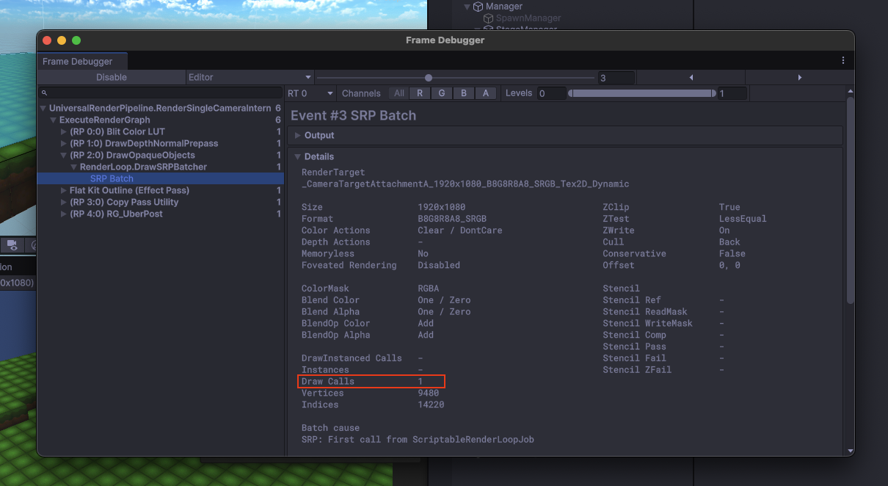

# VoxelActionGame

* Unity 6000.1.50f

* 개발 기간: 2025년 4월 29일 ~ 6월 25일 (MVP 완)

## 목차

1. [게임 개요](#게임-개요)
2. [게임 기능](#게임-기능)
3. [기술적 특징 및 구현 내용](#기술적-특징-및-구현-내용)
4. [주요 개발 과제](#주요-개발-과제-및-해결)
5. [향후 계획](#향후-개선-계획)

## 프로젝트 관련 웹 링크

* [플레이스홀더](https://github.com/Mephilos/MiningActionGame/releases/tag/MAG_Placeholder_v1.0.0)
* [게임 플레이 Web Build](https://play.unity.com/ko/games/246fe740-fe0d-418a-97c2-451cf99717c8/mag-web)
* [데모 동영상](https://youtu.be/1RnSc0YqrwQ)

## 게임 개요

* Voxel Action Game은 절차적으로 생성되는 복셀(Voxel) 지형에서, 스테이지가 진행될수록 강력해지는 적들을 상대로 생존하는 탑다운 액션 게임입니다.

* 플레이어는 스테이지에서 적을 격파하여 얻는 자원으로 캐릭터의 능력치를 성장시키고, 매번 랜덤하게 주어지는 특성(Perk)과 무기 고유의 스킬을 조합하여 자신만의 빌드를 만들어 스테이지를 진행하게 됩니다.

## 게임 기능

* 랜덤생성 무한 스테이지
    * Perlin Noise로 매번 새롭게 생성되는 지형에서 생존 시간에 따라 스테이지를 클리어하고, 5스테이지마다 등장하는 강력한 보스에게 도전합니다.

        

* 게임 플레이 경험 
    * 모든 무기는 고유의 특수 스킬을 가지고 있으며 스테이지 클리어 후 상점에서 능력치를 영구적으로 업그레이드하거나, 랜덤으로 드론과 플레이어에게 제시되는 각각의 특성(Perk) 중 하나를 선택하여 플레이어에게 전략적인 고민을 하게 합니다.

* 조준 시스템 
    * 쾌적한 전투 경험을 위해 단순 거리 기반이 아닌, 원뿔 각도와 장애물 감지를 포함한 다단계 판정 기반의 에임 어시스트를 구현하였습니다. ([PlayerController.cs](https://github.com/Mephilos/MiningActionGame/blob/main/Assets/Scripts/Player/PlayerController.cs#L514-L652))

* 파괴 가능한 환경
    * 플레이어의 스킬이나 폭발로 큐브 모양의 지형이 실시간으로 파괴되며, 이는 전투에 전략적인 변수를 더합니다.

        

## 기술적 특징 및 구현 내용

### 동적 생성 지형

>매번 새로운 경험을 제공하기 위해 Perlin Noise 기반의 동적 지형 생성 시스템을 구현했습니다.

* 다층적 노이즈 적용 
    * 여러 개의 Perlin Noise 함수를 중첩하여 지형을 표현했습니다. ([chuck.cs](https://github.com/Mephilos/MiningActionGame/blob/main/Assets/Scripts/GamePlaySystem/Chunk.cs#L198-L264))

* 가중치 기반 오브젝트 스폰
    * StageThemeData에 정의된 각 오브젝트의 스폰 가중치(SpawnWeight)를 기반으로, 월드에 알맞은 파괴 가능/장식용 오브젝트들을 확률적으로 배치합니다.

* 실시간 지형 파괴와 NavMesh 리빌딩
    * 플레이어의 스킬 등으로 지형이 실시간 파괴될 때마다 NavMeshManager가 해당 NavMeshSurface를 즉시 리빌딩하여, 적 AI가 변경된 지형을 인지하고 경로를 재탐색하도록 구현했습니다.([StageManager.cs](https://github.com/Mephilos/MiningActionGame/blob/main/Assets/Scripts/Manager/StageManager.cs#L418), [NavMeshManager](https://github.com/Mephilos/MiningActionGame/blob/main/Assets/Scripts/Manager/NavMeshManager.cs))

### 데이터 기반 설계 (ScriptableObject)

>게임의 확장성과 유지보수성을 높이기 위해, 프로젝트 전반에 걸쳐 ScriptableObject를 활용한 데이터 기반 설계를 적용했습니다. 이를 통해 코드 변경 없이 데이터 애셋의 수정만으로 콘텐츠 추가 및 밸런스 조정이 용이한 구조를 만들었습니다.

([데이타 스크립트 전반](https://github.com/Mephilos/MiningActionGame/tree/main/Assets/Scripts/Data))

* WeaponData
    * 무기별 데미지, 공격 속도, 투사체, 고유 스킬 등 모든 정보를 포함합니다.

* SkillData
    * 스킬의 효과, 쿨타임 등을 정의하며, ExplosiveGrenadeSkillData, FireSupportSkillData 등 다양한 하위 클래스로 확장됩니다.

* EnemyBaseStatsData
    * 적의 체력, 공격력 등 기본 스탯을 정의합니다.

* StageThemeData
    * 스테이지의 머테리얼, 지형 생성 파라미터, 등장 오브젝트 등 테마별 구성을 관리합니다.

* PerkData 
    * 상점에서 구매할 수 있는 특성의 효과와 비용, 희귀도 등을 관리합니다.

### 이벤트 기반 아키텍처 (Pub/Sub Model)

>싱글턴 패턴을 사용하는 핵심 관리자 클래스들을 통해 게임의 주요 로직을 분리하고, event와 Action을 사용한 발행/구독(Pub/Sub) 모델을 적용하여 클래스 간의 결합도를 낮췄습니다.
    일례로 StageManager가 OnStageCleared 이벤트를 발행하면, UIManager는 클리어 UI를 활성화하고 EnemySpawner는 모든 적 스폰을 중단하는 방식으로 동작합니다. 
    이를 통해 각 시스템은 서로를 직접 참조할 필요 없이 독립적으로 작동하여 유지보수가 용이한 구조를 만들었습니다.

* GameManager 
    * 씬 전환, 선택된 무기 데이터 관리 등 게임의 전반적인 상태를 책임집니다.([GameManager.cs](https://github.com/Mephilos/MiningActionGame/blob/main/Assets/Scripts/Manager/GameManager.cs))
* StageManager
    * 스테이지 로딩, 게임 루프(타이머, 클리어 조건) 관리 등 스테이지 진행의 모든 과정을 총괄하며 핵심 이벤트를 발행합니다.([StageManager](https://github.com/Mephilos/MiningActionGame/blob/main/Assets/Scripts/Manager/StageManager.cs))
* UIManager
    * StageManager의 이벤트를 구독하여 모든 UI 요소를 적시에 업데이트합니다.([UImanager.cs](https://github.com/Mephilos/MiningActionGame/blob/main/Assets/Scripts/UI/UIManager.cs))
* EnemySpawner
    * StageManager의 이벤트를 받아 스테이지에 맞는 적들을 스폰하고 관리합니다.([EnemySpawner.cs](https://github.com/Mephilos/MiningActionGame/blob/main/Assets/Scripts/Enemy/EnemySpawner.cs))
* LeaderboardManager
    * 게임 결과를 바이너리 파일로 저장하고 불러와 랭킹 시스템을 구현했습니다.([LeaderboardManager.cs](https://github.com/Mephilos/MiningActionGame/blob/main/Assets/Scripts/Manager/LeaderboardManager.cs))

### 성능 최적화

* 오브젝트 풀링 (Object Pooling)
    * ObjectPoolManager를 구현하여 총알, 폭발 이펙트 등 자주 생성/파괴되는 오브젝트들을 재활용함으로써 GC(Garbage Collection)을 줄였습니다. ([**ObjectPoolManager.cs**](https://github.com/Mephilos/MiningActionGame/blob/main/Assets/Scripts/ObjectPool/ObjectPoolManager.cs))
* 메시 결합 (Mesh Combining)
    * Chunk.cs에서 수많은 복셀 블록을 텍스처 아틀라스로 제작하고 단일 메시로 결합하여 렌더링 부하를 줄이고 드로우 콜을 줄였습니다.  ([**Chunk.cs**](https://github.com/Mephilos/MiningActionGame/blob/main/Assets/Scripts/GamePlaySystem/Chunk.cs#L318-L489))
    > 맵 단독 렌더링 기준 **DrawCalls 1**
             

## 주요 개발 과제 및 해결

* 문제점: 처음에 계획한 도를 넘은 게임 프로젝트 볼륨
* 해결방법: 현재 개발장비, 여건등을 고려해 청크 방식으로 구현한 대형 월드맵, tps 3d 액션게임을 포기, 단일 청크 생성 방식으로 맵설계 변경, 케릭터 시점과, 조작 방식을 변경해 단순한 탑다운 아레나 형식의 게임 볼륨으로 재설계 하였습니다.

---

* 문제: 수많은 복셀 오브젝트로 인해 발생할 수 있는 드로우콜로 인한 최적화 문제
* 해결: 각 청크의 모든 복셀 메시를 하나로 결합(Mesh Combining)하는 로직을 구현하여 Draw Call을 크게 줄이고 시스템 자원을 줄일수 있었습니다.
---

* 문제: 탑다운 뷰에서 플레이어가 느끼는 조준, Y축 판정의 불합리함.
* 해결: 단순 거리 기반이 아닌, 원뿔 각도와 장애물 감지 등 여러 단계를 거치는 정교한 에임 어시스트 로직을 직접 구현하여 플레이어의 조준이 직관적으로 작용 할 수 있게 구현하였습니다.

---

* 문제: 게임의 확장성을 고려하여, 기능 추가 시 기존 코드에 미치는 영향을 최소화하는 유연한 구조가 필요했습니다.
* 해결: 주요 시스템들을 매니저 클래스로 분리하고, 이들 간의 상호작용을 C# event 기반의 발행/구독 모델로 구현하여 결합도를 낮췄습니다. 그 결과 새로운 시스템이 추가되어도 기존 코드를 수정할 필요가 없어졌습니다.

---

* 문제: 게임의 특성상 많은 아이템 특성과, 다양한 적들 등 여러가지의 컨텐츠 요소들이 필요한데, 게임 볼륨이 커질 수록 관리의 어려움이 커질 것으로 생각되었습니다.
* 해결: 비슷한 계열의 오브젝트들, 게임 요소들을 ScriptableObject 방식으로 사용 할 수 있게 재설계 하였습니다.

## 향후 개선, 계획

* 좀 더 나은 최적화
    * 현재 맵 파괴시 파괴된 메시를 다시 계산하여 생성 출력하는 로직을 사용하고 있어 매번 맵파괴시 매번 새로운 맵이 생성되는 방식(시스템 리소스 많이 잡아 먹음)추후 마인크래프트에서 구현되어 있는 부분 매쉬 파괴, 재생성을 구현하여 맵 파괴시 걸리는 부하를 줄일 예정

* 보스 바리에이션 추가
    * Midboss의 상태머신을 개선 + 불륨을 늘려 좀 더 다양한 패턴의 보스를 제작하여 지형파괴 기믹이 좀더 유의미 하게 활용 되게 할 예정

* 퍽의 바리에이션 추가
    * 여러가지 퍽의 추가로 플레이어의 플레이 방식을 늘릴 예정.
(일정 확률로 스킬 쿨다운 초기화, 일반공격시 일정확률로 크리티컬)
무기마다 고유한 퍽과, 드론고유의 기능(일반공격을 하지 않게되는 대신 타켓에게 특정 디버프, 또는 플레이어에게 버프를 주는)퍽 추가 예정

* 지속가능한 요소 추가
    * 스테이지가 끝난후 영구적으로 능력치를 강화하거나, 특성을 부여하는 요소를 추가하여 반복 플레이시 영구적으로 플레이어가 강해질 수 있는 요소.

<strong>사용한 서드파티 에셋(클릭하여 펼치기)</strong>

>본 프로젝트는 서드파티 에셋을 포함하여 개발 중이며, 저작권 보호를 위해 저장소에는 포함하지 않았습니다.

* **Models**
    * [Droll Robot 05](https://assetstore.unity.com/packages/3d/characters/robots/droll-robot-05-250158)
    * [Robot Hero : Modular Polyart](https://assetstore.unity.com/packages/3d/characters/robots/robot-hero-modular-polyart-163308)
    * [Fatty Poly Turret Free](https://assetstore.unity.com/packages/3d/props/weapons/fatty-poly-turret-free-155251)
    * [SciFi Enemies and Vehicles](https://assetstore.unity.com/packages/3d/characters/robots/scifi-enemies-and-vehicles-15159)
    * [Rockets, Missiles & Bombs - Cartoon Low Poly Pack](https://assetstore.unity.com/packages/3d/props/weapons/rockets-missiles-bombs-cartoon-low-poly-pack-73141)
* **SKYBOX** 
    * [Skybox Series Free](https://assetstore.unity.com/packages/2d/textures-materials/sky/skybox-series-free-103633)
* **VFX**
    * [Stylized Shoot & Hit Vol.1](https://assetstore.unity.com/packages/vfx/particles/stylized-shoot-hit-vol-1-216558)
    * [Stylized Explosion Package](https://assetstore.unity.com/packages/vfx/particles/stylized-explosion-package-190334)
* **Shader**
    * [Flat Kit: Toon Shading and Water](https://assetstore.unity.com/packages/vfx/shaders/flat-kit-toon-shading-and-water-143368)

